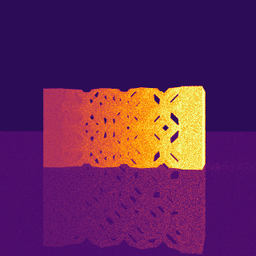

# Blender Stardis Exporter

A [Blender](https://blender.org) add-on that helps the user to compose a scene for thermal analysis and rendering in [Stardis](https://www.meso-star.com/projects/stardis/stardis.html). 
With the add-on, users can specify thermal properties of meshes in a Blender scene, and export the meshes into `.stl` files, and a text file describing the thermal properties per [Stardis Input Format](https://www.meso-star.com/projects/stardis/man/man5/stardis-input.5.html). 

## Requirement

The add-on is tested on macOS, with Blender version 4.0.
Blender version 3+ is likely to work, but no guarantees.

## Validation

The `porous` scene in the [Stardis Starter Package](https://www.meso-star.com/projects/stardis/starter-pack.html) is used as a test case. The renders produced per the original scene description (left) and the one generated with this add-on (right) are as below:

	
	

